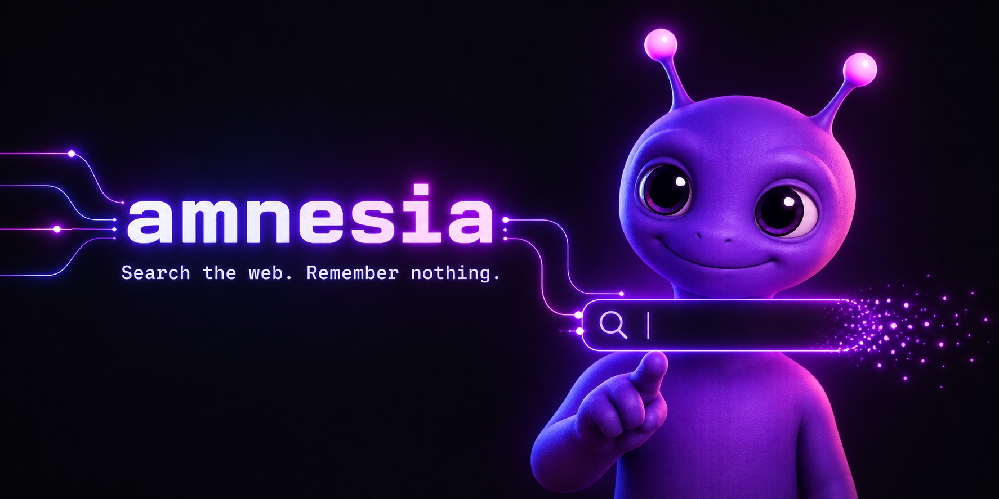
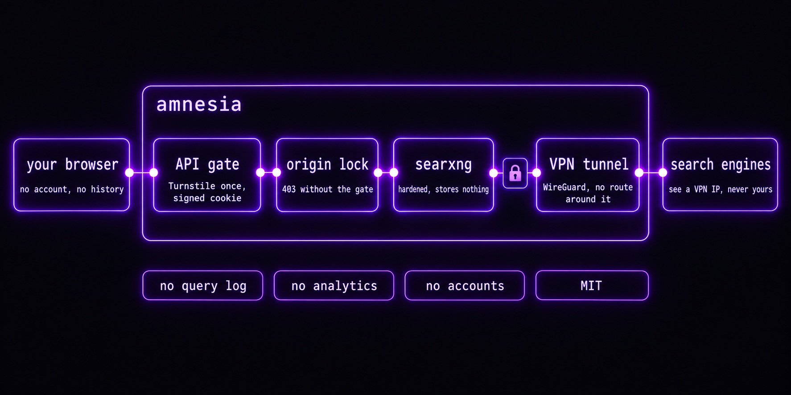

<div align="center">

<a href="https://amnesia.tax"></a>

# `amnesia`

### Search the web. Remember nothing.<br/>A privacy search engine that shows its work: every claim here comes with a command you can run.

<p>
  <a href="https://amnesia.tax"></a>
  <a href="docs/self-host.md"></a>
  <a href="https://github.com/askalf/amnesia/actions/workflows/ci.yml"></a>
  <a href="https://github.com/askalf/amnesia/actions/workflows/image.yml"></a>
  <a href="https://github.com/askalf/amnesia/actions/workflows/codeql.yml"></a>
  <a href="https://github.com/askalf/amnesia/actions/workflows/canary.yml"></a>
  <a href="https://scorecard.dev/viewer/?uri=github.com/askalf/amnesia"></a>
  <a href="https://www.bestpractices.dev/projects/14490"></a>
  <a href="LICENSE"></a>
  <a href="https://github.com/sponsors/askalf"></a>
</p>

<sub>no accounts · no ads · no analytics · no query log · one ~45 KB HTML file · engine traffic only through a VPN · MIT</sub>

<sub><a href="#use-it">Use it</a> · <a href="#run-your-own">Run your own</a> · <a href="#check-it-yourself">Check it yourself</a> · <a href="#who-sees-your-query">Who sees your query</a> · <a href="#how-its-built">How it's built</a> · <a href="#reference">Reference</a> · <a href="#sponsor">Sponsor</a></sub>

</div>

---

Most private search engines ask you to trust a privacy policy. Amnesia is built so you don't have to. There is no account to tie a query to and no query log to hand over. The code is public, and every guarantee points at the line of code or configuration that enforces it and a command that checks it against the live site.

## Use it

**[amnesia.tax](https://amnesia.tax)**. Nothing to install and nothing to sign up for. Web, images, news and videos, with autocomplete, pagination and dark and light themes. The page advertises itself over OpenSearch, so your browser can make it the default search engine.

## Run your own

```bash
docker run -d -p 8080:8080 ghcr.io/askalf/amnesia
```

Open <http://localhost:8080>. It's the same page and the same SearXNG tuning in one container, and the page talks only to its own origin: no Cloudflare, no Turnstile, `connect-src 'self'`. The image is multi-arch, runs unprivileged, and ships SLSA build provenance you can check with `gh attestation verify`. From a home connection, it also turns back on the engines the hosted instance can't reach through a VPN. The [self-host guide](docs/self-host.md) covers the hardened run line, the options, and the full production shape (VPN by network namespace, tunnel, gated Worker).

## Check it yourself



That picture is a recording of the live endpoints. [`scripts/readme/verify.mjs`](scripts/readme/verify.mjs) performs each request and refuses to write the image if any answer differs from the claim beside it. Run the same checks yourself:

```bash
curl -so /dev/null -w '%{http_code}' https://amnesia.tax/                                 # 200
curl -so /dev/null -w '%{http_code}' 'https://api.amnesia.tax/search?q=test&format=json'  # 401
curl -so /dev/null -w '%{http_code}' 'https://search-origin.amnesia.tax/search?q=test'    # 403
curl -sI https://amnesia.tax/ | grep -c unsafe-inline                                     # 0
```

The full list covers every guarantee, what enforces it, and how to verify it, including the two places where the live site still falls short of this repo: **[privacy model](docs/privacy-model.md#guarantees-and-how-to-check-them)**.

## Who sees your query



| On the path | Sees | Keeps |
|---|---|---|
| **Your browser** | everything | a theme preference; nothing is sent to us about you |
| **API gate** (Cloudflare Worker) | your IP and the query (Cloudflare terminates TLS) | an edge-cache entry keyed on the query text alone: 3 minutes for a search, 6 hours for autocomplete; never your IP, cookie or token |
| **Origin lock** (WAF) | the request, only to refuse it | nothing: a 403 for anything without the gate's secret |
| **SearXNG** | the query, with no client IP | nothing: no result cache, no access log |
| **VPN** (ProtonVPN over WireGuard) | encrypted traffic | per ProtonVPN's policy |
| **Search engines** | the query and a VPN exit IP | whatever they keep for an anonymous datacenter IP; never your IP |
| **Image hosts** (image search only) | your IP, when your browser loads a thumbnail; no referrer, so not the query | whatever each host keeps |

Amnesia doesn't protect against a global adversary watching both ends, a compromised Cloudflare account, or an engine fingerprinting you by what you search. The [privacy model](docs/privacy-model.md#who-sees-what) explains why, and what to do if you need that.

## How it's built

- **A bot gate that isn't a CAPTCHA per search.** A Cloudflare Worker verifies one Turnstile solve and issues an HMAC-signed session cookie good for 6 hours, renewed while you keep searching up to 24 hours from the solve; searches in that window never see a challenge. The gate fails **closed** when its secrets are missing. [Architecture](docs/architecture.md)
- **No way around the gate.** A WAF rule answers 403 to any request on the backend hostname without the gate's secret header, and zone rate limits cover `/search` on both hosts.
- **One way out: the VPN.** SearXNG has no network interface of its own. It runs inside Gluetun's network namespace, and Gluetun drops all traffic while the tunnel is down, so a VPN outage takes search down rather than leaking your queries out the host's own IP. The container runs with no Linux capabilities, a read-only root, `no-new-privileges`, a memory cap and a digest-pinned image.
- **One HTML file, CSP by hash.** About 45 KB with no framework and no build step, and fonts are self-hosted. Web search makes no third-party request except the Turnstile challenge; image search also loads each thumbnail from its own host, which is the one place your IP reaches anyone but Cloudflare. The Content-Security-Policy allows the page's one script and one style by SHA-256 hash, generated from the HTML by [a script](scripts/csp-hashes.mjs) that CI re-runs on every change.
- **Tested, fuzzed, scanned.** 46 zero-dependency `node:test` tests drive the Worker's real export (forged, expired and spliced cookies, the Turnstile hostname check, CORS, a cache key with no cookie, token or IP) and run the page's URL guards from its own bytes. ClusterFuzzLite fuzzes the cookie boundary weekly, and CodeQL runs on every push.
- **Watched every day.** A canary at 14:17 UTC checks the live site (200), the gate (401), the origin lock (403), the OpenSearch file and the deploy token's expiry, and fails if the OpenSSF Scorecard drops.
- **Engines that can't see you.** The hosted instance queries Brave, Bing, DuckDuckGo, Yandex, Crowdview, searchmysite and Wikipedia for the web, plus per-category engines, all through the VPN. Google, Mojeek and Qwant refuse every VPN exit, so the hosted instance does without them. [Engine coverage](docs/engines.md)

## Trust and transparency

| Signal | Status |
|---|---|
| Source | One HTML file, one zero-dependency Worker, one SearXNG config, one image definition. MIT. |
| Dependencies | Zero at runtime. The only npm package is the fuzzer, a dev dependency. |
| Supply chain | Every action pinned to a commit SHA, every image pinned to a digest; the self-host image carries SLSA build provenance. |
| OpenSSF Scorecard | Live badge above, recomputed on every push to `main`. A PR job scores the PR's own tree and holds pinning, token permissions, dangerous workflows and binaries at 10; the daily canary fails on any drop. |
| Tests | `npm test` on every PR, a smoke test of the built image (plain and hardened) on every image change, weekly fuzzing, CodeQL. |
| Disclosure | [`SECURITY.md`](SECURITY.md). Please don't open a public issue for a vulnerability. |

## Reference

- **[Privacy model](docs/privacy-model.md)**: who sees what on a query's path, every guarantee with a command to check it, and the honest caveats.
- **[Architecture and security](docs/architecture.md)**: the front end, API gate, origin lock and backend, plus tests, fuzzing, static analysis, runner isolation and deploy ordering.
- **[Engine coverage](docs/engines.md)**: what the hosted instance queries, why Google, Mojeek and Qwant are absent, and why engines get removed.
- **[Self-host](docs/self-host.md)**: the one-container image, its hardened run line and options, and the full production shape.
- **[README assets](scripts/readme/README.md)**: how the pictures on this page are made, and which one is generated from a live run.

## Sponsor

<!-- sponsors:start -->
amnesia has no ads and no tracking, so it is funded by its users through [GitHub Sponsors](https://github.com/sponsors/askalf): the VPN exit and the server behind the hosted instance are the running costs. Sponsors at $25/month and up are listed here.
<!-- sponsors:end -->

<sub>This block comes from <a href="scripts/sponsors.mjs"><code>scripts/sponsors.mjs</code></a>, which reads the public sponsor list; <code>sponsors-readme.yml</code> opens a PR when it changes (its checks run only with an <code>AMNESIA_BOT_PAT</code> secret; without one, close and reopen that PR). Private sponsors are never named.</sub>

## Project

- [`CHANGELOG.md`](CHANGELOG.md): what changed and why
- [`SECURITY.md`](SECURITY.md): reporting a vulnerability
- [`CONTRIBUTING.md`](CONTRIBUTING.md): how to send a change
- [SearXNG](https://github.com/searxng/searxng) and [Gluetun](https://github.com/qdm12/gluetun): the two projects this stands on
- [askalf.org](https://askalf.org): the AI operation that runs Sprayberry Labs, including Amnesia

## License

MIT. Part of **[Own Your Stack](https://github.com/askalf)**: own your infrastructure instead of renting it by the token. Built by Thomas Sprayberry.
