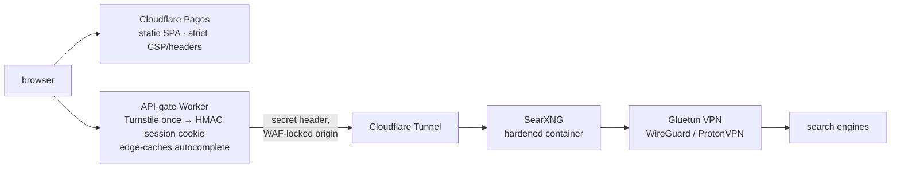

<div align="center">

# Amnesia

**Search the web. Remember nothing.**

Privacy-first meta-search: no tracking, no ads, no accounts, no search history — with a bot-gated API and a VPN between every query and the engines. Live at **[amnesia.tax](https://amnesia.tax)**, self-hostable from this repo.

[](https://amnesia.tax)
[](LICENSE)

[](https://github.com/askalf/amnesia/actions/workflows/ci.yml)
[](https://github.com/askalf/amnesia/actions/workflows/codeql.yml)
[](https://github.com/askalf/amnesia/actions/workflows/canary.yml)
[](https://scorecard.dev/viewer/?uri=github.com/askalf/amnesia)

[Privacy](#privacy) · [Architecture](#architecture--the-one-that-actually-runs) · [Security](#security--the-part-most-search-frontends-skip) · [Engine coverage](#engine-coverage--honest-numbers) · [Self-host](#self-host)

</div>

---

## Privacy

| | Amnesia | Google | Bing | DuckDuckGo |
|---|:---:|:---:|:---:|:---:|
| Cookies | Session-only, anonymous* | Yes | Yes | Yes |
| Search history | None | Stored | Stored | None** |
| IP logging | None | Yes | Yes | Partial |
| Ads | None | Yes | Yes | Yes |
| Tracking pixels | None | Yes | Yes | None |

\* one HMAC-signed, 30-minute session cookie so the bot-check solves **once**, not per search — it identifies a *session*, never a person, and stores nothing.
\** DuckDuckGo doesn't store searches but does log metadata.

Amnesia stores nothing. No accounts, no analytics, no server-side query logs. The SearXNG backend proxies every query through an encrypted VPN — search engines see the VPN exit IP, never yours.

## Architecture — the one that actually runs



- **Front end** — one self-contained HTML file (`src/amnesia-search.html`, ~46 KB): inline CSS/JS, self-hosted fonts, no framework, no build step, no third-party requests beyond the Turnstile challenge. Category tabs, engine tags per result, debounced autocomplete, pagination, timing, OpenSearch integration, dark/light mode.
- **API gate** — a Cloudflare Worker in front of the backend. First visit solves a Turnstile check and gets a signed session cookie; every search after that is cookie-authenticated. Fails **closed** if its secrets are unset. Autocomplete responses are edge-cached (6 h) so suggestions don't hammer the backend per keystroke.
- **Origin lock** — the backend hostname answers only to the Worker: a WAF rule 403s any request without the gate's secret header, plus zone rate-limits on `/search` for both hosts. You can't reach SearXNG around the gate (try it: `search-origin.amnesia.tax/search` → 403).
- **Backend** — a single hardened SearXNG container (`cap_drop: ALL`, read-only rootfs, no-new-privileges, memory-capped, digest-pinned) whose **only egress is the VPN**. No result cache, no Redis/valkey, no nginx — deliberately: fewer moving parts holding your queries is the point.

## Security — the part most search frontends skip

- **The session-auth boundary is fuzzed in CI** — ClusterFuzzLite drives the Worker's cookie sign/verify against forgery and splice attacks on every change ([`fuzz/session.fuzz.js`](fuzz/session.fuzz.js)).
- **Result URLs are scheme-allowlisted** (`safeUrl()`): a poisoned engine result carrying a `javascript:`/`data:` URL is dropped before it can become a clickable script. Verified against the **live deployed site** with real-browser request-interception injection tests, not just unit tests.
- **CodeQL + OpenSSF Scorecard + weekly canary** (token health + live smoke: site 200 / gate 401 / origin 403) run continuously; actions are SHA-pinned; CI for fork-reachable workflows runs on GitHub-hosted runners so untrusted PR code never touches the deploy host.
- **Strict headers/CSP** ship with the site (`src/_headers`); Turnstile is the only third party in the policy.
- **History was scrubbed before this repo went public** and secrets live only in Worker bindings / CI secrets — nothing in the tree, nothing in the history.

## Engine coverage — honest numbers

SearXNG's catalog spans **155+ engines**, and self-hosters get all of it. The hosted instance at amnesia.tax deliberately runs a **curated set that actually works from behind a VPN** — currently Brave, Bing, DuckDuckGo, Yandex, Presearch, Crowdview, and searchmysite for web, plus per-category engines (news, images, videos, science, dev, social, files).

Why not Google/Mojeek/Qwant? They block datacenter IP ranges wholesale — every VPN exit is a datacenter IP, so those engines refuse the hosted instance's queries no matter which exit it uses. That's the privacy-vs-coverage tradeoff made explicit: **the engines that can't see you are the engines you get.** Broken or perma-blocked engines are disabled rather than left to time out, which is also why searches stay fast (~1–2 s end-to-end). The live engine set is mirrored in [`infra/searxng/settings.yml`](infra/searxng/settings.yml).

## Self-Host

Minimal (your own machine, your own IP — every engine available, no gate needed):

```bash
docker run -d --name searxng -p 8080:8080 searxng/searxng
# serve src/amnesia-search.html from any static server, pointed at your instance
```

The full production shape — VPN egress, hardened container, tunnel, gated Worker — is documented in [`infra/`](infra/) (compose file, SearXNG settings, tunnel ingress snippet, [`DEPLOY.md`](infra/DEPLOY.md)). The Worker lives in [`worker/`](worker/) and deploys with `wrangler`; the site deploys to any static host (Cloudflare Pages here, via [`deploy.yml`](.github/workflows/deploy.yml)).

## Layout

```
src/                 the SPA: amnesia-search.html (~46 KB, self-contained) + _headers (CSP) + fonts + og
worker/              the API-gate Worker: Turnstile → HMAC session, /search /autocompleter /session /healthz
infra/               production mirror: compose, hardened SearXNG settings, tunnel ingress, DEPLOY.md
fuzz/                ClusterFuzzLite target for the session-cookie auth boundary
.github/workflows/   ci · codeql · cflite · scorecard · canary (weekly live smoke) · deploy + deploy-worker
```

## Stack

`HTML` · `CSS` · `JavaScript` · `SearXNG` · `Cloudflare Pages + Workers + Tunnel + WAF` · `Turnstile` · `Gluetun (WireGuard)` · `ProtonVPN`

## Related

- [SearXNG](https://github.com/searxng/searxng) — the meta-search engine that powers Amnesia
- [Gluetun](https://github.com/qdm12/gluetun) — VPN tunnel for containerized services
- [askalf](https://askalf.org) — the AI operation that runs Sprayberry Labs (includes Amnesia)

## License

MIT — [askalf.org](https://askalf.org) · Live at [amnesia.tax](https://amnesia.tax)

---
Part of **[Own Your Stack](https://github.com/askalf)** — own your AI infrastructure instead of renting it by the token. Built by Thomas Sprayberry.
