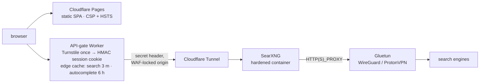

<div align="center">

# Amnesia

**Search the web. Remember nothing.**

A privacy meta-search engine with no accounts, no ads, no analytics, and no server-side query log — fronted by a bot gate that solves once per session, and egressing to the engines through a VPN. Live at **[amnesia.tax](https://amnesia.tax)**. Self-hostable from this repo.

[](https://amnesia.tax)
[](LICENSE)

[](https://github.com/askalf/amnesia/actions/workflows/ci.yml)
[](https://github.com/askalf/amnesia/actions/workflows/codeql.yml)
[](https://github.com/askalf/amnesia/actions/workflows/canary.yml)
[](https://scorecard.dev/viewer/?uri=github.com/askalf/amnesia)

[What sets it apart](#what-sets-it-apart) · [Who sees what](#who-sees-what) · [Guarantees](#guarantees-and-how-to-check-them) · [Architecture](#architecture) · [Security](#security) · [Engines](#engine-coverage) · [Self-host](#self-host)

<a href="https://amnesia.tax"></a>

</div>

---

## What sets it apart

Most privacy search front-ends are a stock [SearXNG](https://github.com/searxng/searxng) behind a reverse proxy. Amnesia is what you get when a SearXNG deployment is treated as production infrastructure:

- **A bot gate that isn't a per-query CAPTCHA.** A Cloudflare Worker sits in front of the backend. One Turnstile solve issues an HMAC-signed, 30-minute session cookie; every search after that is cookie-authenticated and never sees a challenge. The gate fails **closed** if its secrets are missing.
- **The auth boundary is fuzzed in CI.** ClusterFuzzLite drives the Worker's cookie sign/verify against forgery and splice attacks ([`fuzz/session.fuzz.js`](fuzz/session.fuzz.js)). OpenSSF Scorecard **Fuzzing** and **Token-Permissions** both score 10.
- **The origin cannot be reached around the gate.** A WAF rule on the backend hostname returns 403 to any request without the gate's secret header, plus zone rate limits on `/search` for both hosts. Try it: [`search-origin.amnesia.tax/search?q=test`](https://search-origin.amnesia.tax/search?q=test).
- **Engine traffic leaves through a VPN, from a hardened container.** SearXNG runs with `cap_drop: ALL`, a read-only root filesystem, `no-new-privileges`, a memory cap, and a digest-pinned image, and routes engine requests through a WireGuard tunnel (ProtonVPN via Gluetun).
- **A daily live canary, not just unit tests.** Every day at 14:17 UTC a GitHub-hosted job checks the deploy token's expiry and smoke-tests the live stack: site 200, gate 401, origin 403.
- **One 44 KB HTML file.** No framework, no build step, self-hosted fonts, no third-party request except the Turnstile challenge. Category tabs, per-result engine tags, debounced autocomplete, pagination, OpenSearch, dark/light.

## Who sees what

A privacy claim is only as good as its threat model. This is the full path a query takes and what each party can observe. **"Stores" means retained after the response is sent.**

| Party | Sees | Stores |
|---|---|---|
| **You (browser)** | Everything. Theme preference lives in `localStorage`. | Nothing is sent to us. No history, no account. |
| **Cloudflare edge** (Pages, Worker, Tunnel) | Your IP and the query in plaintext. Cloudflare terminates TLS, so the Worker reads `?q=` to proxy it. | An **edge cache entry** keyed on the normalized query text, for **3 minutes** (`/search`) or **6 hours** (`/autocompleter`). The key never includes a cookie, token, or IP. Cloudflare's own edge logging is governed by [Cloudflare's policies](https://www.cloudflare.com/privacypolicy/), not by this repo. |
| **The session cookie** | Nothing. It is an HMAC over a timestamp under the operator's secret — it identifies a *session*, not a person. | 30 minutes, in your browser. The server keeps no session table. |
| **SearXNG backend** | The query, arriving with the gate's user agent and no client IP. | Nothing. No result cache, no Redis, no access log. |
| **VPN provider** (ProtonVPN) | Encrypted traffic leaving the backend for the engines. | Per ProtonVPN's policy; the tunnel carries no query in plaintext. |
| **Search engines** (Brave, Bing, DuckDuckGo, …) | The query and the VPN exit IP. | Whatever each engine retains for a datacenter IP with no cookies. They never see your IP. |
| **Amnesia's operator** | Nothing per-user. | Nothing. No analytics, no server-side query log. |

What this does **not** protect against: a global adversary correlating traffic at both ends, a compromised Cloudflare account, or an engine fingerprinting queries by content. If you need that, run the [self-host](#self-host) shape on hardware you control, or use Tor.

## Guarantees, and how to check them

Every row is enforced by code or configuration in this repo, and every row has a check you can run yourself without trusting the README.

| Guarantee | Enforced by | Verify it |
|---|---|---|
| No search without the gate | WAF rule: 403 unless the gate's secret header is present; the Worker sets it, nothing else can | `curl -s -o /dev/null -w '%{http_code}' 'https://search-origin.amnesia.tax/search?q=test'` → `403` |
| No search without a session | Worker: cookie → allow; valid Turnstile token → allow and issue cookie; else 401 ([`worker/src/index.js`](worker/src/index.js)) | `curl -s -o /dev/null -w '%{http_code}' 'https://api.amnesia.tax/search?q=test&format=json'` → `401` |
| Gate fails closed | Worker returns `500 misconfigured` if `SESSION_SECRET` or `TURNSTILE_SECRET` is unset, before any auth path runs | Read the env check at the top of `fetch()` in the Worker |
| Session cookie cannot be forged | HMAC-SHA-256 over a timestamp under `SESSION_SECRET`, verified with a constant-time compare (`timingSafeEqual`) | `npm run fuzz` runs the forgery, splice, and cross-secret targets locally; ClusterFuzzLite runs them weekly |
| Responses are never cached in your browser | Every proxied `/search` and `/autocompleter` response, edge hit or miss, is sent with `cache-control: no-store` | The two response-header sites in the Worker's proxy section; or inspect any search in DevTools |
| Script runs only from `'self'`, inline, and Turnstile | CSP `script-src 'self' 'unsafe-inline' https://challenges.cloudflare.com`, HSTS preload, `X-Frame-Options: DENY`, `Referrer-Policy: no-referrer` ([`src/_headers`](src/_headers)); `'unsafe-inline'` is the caveat below | `curl -sI https://amnesia.tax/ \| grep -iE 'content-security-policy\|referrer-policy'` |
| Result links cannot execute script | `safeUrl()` in the SPA allows only `http:` and `https:`; a `javascript:` or `data:` URL from a poisoned engine renders with no link | Read `safeUrl()` in [`src/amnesia-search.html`](src/amnesia-search.html) |
| Backend cannot escalate | `cap_drop: ALL`, `read_only: true`, `no-new-privileges`, tmpfs for the only writable paths, 512 MB memory cap, digest-pinned image ([`infra/docker-compose.yml`](infra/docker-compose.yml)) | `docker inspect amnesia-searxng` on a self-host |
| Engine traffic leaves via VPN | SearXNG's `HTTP_PROXY` / `HTTPS_PROXY` point at the Gluetun proxy | `docker exec amnesia-searxng sh -c 'curl -s -x http://gluetun:8888 https://ifconfig.me'` returns the VPN exit, not the host IP |
| Nothing in git history | History scrubbed before the repo went public; secrets exist only as Worker bindings and CI secrets | `git log -p \| grep -iE 'secret\|token'` finds names, never values |
| It is still up and still gated | Daily canary at 14:17 UTC: token-expiry check + live smoke (site 200 / gate 401 / origin 403) | [canary runs](https://github.com/askalf/amnesia/actions/workflows/canary.yml) |

Two honest caveats. The site is a single self-contained file, so its inline script and style require `'unsafe-inline'` in the CSP; external origins are still limited to Turnstile, and hashed inline sources are the next step. And the VPN row is enforced by **configuration, not by a network boundary**: SearXNG is told to use the proxy rather than living inside the VPN container's network namespace, so an engine that ignored the proxy environment would leave by the host IP. The live instance is checked with the command in the table; if you self-host the full shape, prefer `network_mode: "service:gluetun"` for a hard guarantee.

## Architecture



- **Front end** — [`src/amnesia-search.html`](src/amnesia-search.html), 44 KB, self-contained. Pre-warms the session cookie on page load so the first search never waits on Turnstile; on a 401 it solves once and retries. Autocomplete is best-effort and never triggers a challenge.
- **API gate** — [`worker/src/index.js`](worker/src/index.js). Authorizes (cookie, else token, else 401), proxies `/search` and `/autocompleter` to the origin with the secret header, and stores successful answers at the edge under a key built from the normalized query and sorted params. Clients always receive `no-store`; the edge copy's own `cache-control` governs its lifetime.
- **Origin lock** — the backend hostname answers only to the Worker. WAF returns 403 without the secret header; zone rate limits cover `/search` on both hosts.
- **Backend** — one SearXNG container, no result cache, no Redis or Valkey, no nginx. Fewer components holding a query is the design goal, not a shortcut. Outgoing request timeout is 4 s with an 8 s ceiling: healthy engines answer well under 1.5 s, and a flaky one is bounded rather than waited on.

## Security

- **Fuzzing** — [`fuzz/session.fuzz.js`](fuzz/session.fuzz.js) pins the cookie contract: never throws on a hostile value, never verifies a value the operator's secret did not sign, always round-trips under its own secret and never under another. Runs weekly in ClusterFuzzLite and locally via `npm run fuzz`. The target is async (WebCrypto HMAC), so it runs in Jazzer's async mode.
- **Static analysis** — CodeQL on every push and PR; OpenSSF Scorecard weekly. All actions are SHA-pinned.
- **Runner isolation** — CI for fork-reachable workflows runs on GitHub-hosted runners. Only the deploy jobs, which run from `main` after review, touch the self-hosted deploy host.
- **Deploys are serialised** — Pages and Worker deploys queue rather than cancel, so two pushes to `main` never land out of order or half-applied.
- **Disclosure** — see [`SECURITY.md`](SECURITY.md). Please do not open a public issue for a vulnerability.

## Engine coverage

SearXNG's catalog spans **155+ engines**, and self-hosters get all of it. The hosted instance runs a **curated set that works from behind a VPN**, kept honest by measurement rather than by hope.

**Live for web search:** Brave, Bing, DuckDuckGo, Yandex, Crowdview, searchmysite. Plus per-category engines for news, images, videos, science, developer sources (GitHub, GitLab, Stack Overflow, npm, PyPI, crates.io, Docker Hub, MDN, Hugging Face, NVD), social, and files. The exact set, with a dated reason next to every disabled engine, is in [`infra/searxng/settings.yml`](infra/searxng/settings.yml).

**Why not Google, Mojeek, Qwant?** They block datacenter IP ranges wholesale, and every VPN exit is a datacenter IP. Tested and confirmed; no exit unblocks them. That is the privacy-versus-coverage trade-off made explicit: **the engines that cannot see you are the engines you get.**

**Why engines get removed.** Presearch was dropped in August after it ignored the per-engine timeout and pinned every search at a constant 5.2 s; without it, searches complete in roughly one second with *more* results. Startpage went for chronic CAPTCHAs behind VPN. Broken engines are disabled rather than left to time out. That policy is why the site is fast.

## Self-host

**Minimal** — your own machine, your own IP, every engine available, no gate needed:

```bash
docker run -d --name searxng -p 8080:8080 searxng/searxng
```

Then serve `src/amnesia-search.html` from any static host and point it at your instance. The API origin is one line near the top of the script:

```js
const API_BASE = window.location.hostname === 'localhost' ? '' : 'https://api.amnesia.tax';
```

The empty-string branch is same-origin and skips Turnstile entirely, so the simplest setup is to serve the page from the same origin as SearXNG (a reverse proxy in front of both). Otherwise set the string to your SearXNG URL and allow your page origin in SearXNG's CORS settings; the Turnstile warm-up resolves empty and searches proceed. The SPA calls `/search?q=…&format=json` and `/autocompleter?q=…`, both served natively by SearXNG.

**Full production shape** — VPN egress, hardened container, tunnel, gated Worker:

```bash
cp infra/.env.example infra/.env        # set AMNESIA_SEARXNG_SECRET and your network name
docker compose -f infra/docker-compose.yml up -d
```

[`infra/docker-compose.yml`](infra/docker-compose.yml) ships the hardened SearXNG service and expects a Gluetun container named `gluetun` on the shared network to exist already; it does not bundle the VPN. [`infra/DEPLOY.md`](infra/DEPLOY.md) covers the tunnel ingress, the WAF origin-lock rule, and the egress check. The Worker lives in [`worker/`](worker/) with its own [`DEPLOY.md`](worker/DEPLOY.md) and deploys with `wrangler`. The site deploys to any static host; here it is Cloudflare Pages via [`deploy.yml`](.github/workflows/deploy.yml).

## Layout

```
src/                 the SPA (44 KB, self-contained) + _headers (CSP) + fonts + og + robots + sitemap
worker/              API-gate Worker: Turnstile → HMAC session, /search /autocompleter /session /healthz
infra/               production mirror: compose, SearXNG settings, tunnel ingress, DEPLOY.md
fuzz/                ClusterFuzzLite target for the session-cookie auth boundary
.github/workflows/   ci · codeql · cflite · scorecard · canary (daily live smoke) · deploy + deploy-worker
```

## Stack

`HTML` · `CSS` · `JavaScript` · `SearXNG` · `Cloudflare Pages + Workers + Tunnel + WAF` · `Turnstile` · `Gluetun (WireGuard)` · `ProtonVPN`

## Project

- [`CHANGELOG.md`](CHANGELOG.md) — what changed and why
- [`SECURITY.md`](SECURITY.md) — reporting a vulnerability
- [`CONTRIBUTING.md`](CONTRIBUTING.md) — how to send a change
- [SearXNG](https://github.com/searxng/searxng) and [Gluetun](https://github.com/qdm12/gluetun) — the two projects this stands on
- [askalf.org](https://askalf.org) — the AI operation that runs Sprayberry Labs, including Amnesia

## License

MIT. Part of **[Own Your Stack](https://github.com/askalf)** — own your infrastructure instead of renting it by the token. Built by Thomas Sprayberry.
