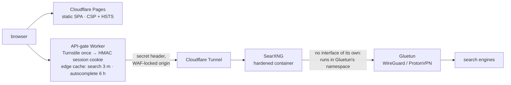

# Amnesia architecture and security

Back to the [README](../README.md).

## Architecture

- **Front end** — [`src/amnesia-search.html`](../src/amnesia-search.html), 44 KB, self-contained. Pre-warms the session cookie on page load so the first search never waits on Turnstile; on a 401 it solves once and retries. Autocomplete is best-effort and never triggers a challenge.
- **API gate** — [`worker/src/index.js`](../worker/src/index.js). Authorizes (cookie, else token, else 401), proxies `/search` and `/autocompleter` to the origin with the secret header, and stores successful answers at the edge under a key built from the normalized query and sorted params. Clients always receive `no-store`; the edge copy's own `cache-control` governs its lifetime.
- **Origin lock** — the backend hostname answers only to the Worker. WAF returns 403 without the secret header; zone rate limits cover `/search` on both hosts.
- **Backend** — one SearXNG container, no result cache, no Redis or Valkey, no nginx. Fewer components holding a query is the design goal, not a shortcut. Every enabled engine has a 3 s timeout and no retries, and a client's `timeout_limit` is capped at 5 s: healthy engines answer well under 1.5 s, and a flaky one is bounded rather than waited on. Per-engine timing is on the host at `127.0.0.1:8081/stats`.

## Security

- **Fuzzing** — [`fuzz/session.fuzz.js`](../fuzz/session.fuzz.js) pins the cookie contract: never throws on a hostile value, never verifies a value the operator's secret did not sign, always round-trips under its own secret and never under another. Runs weekly in ClusterFuzzLite and locally via `npm run fuzz`. The target is async (WebCrypto HMAC), so it runs in Jazzer's async mode.
- **Tests** — [`test/`](../test/) drives the Worker's real default export with the Workers globals stubbed (fail-closed, cookie forgery and expiry, the Turnstile hostname check, CORS, an edge-cache key that holds no cookie, token or IP) and runs the SPA's URL guards from the page's own bytes. `npm test`, zero dependencies, on every PR.
- **Static analysis** — CodeQL on every push and PR; OpenSSF Scorecard weekly and on every push to `main`, plus a PR job that scores the four file-based checks (pinning, token permissions, dangerous workflows, binaries) on the PR's own tree and fails below 10. All actions are SHA-pinned.
- **Runner isolation** — CI for fork-reachable workflows runs on GitHub-hosted runners. Only jobs that run from `main` touch the self-hosted host: the deploys, after review, and the review kick, which runs `main`'s copy of its workflow on a same-repo PR and never checks out PR code.
- **Deploys are serialised** — Pages and Worker deploys queue rather than cancel, so two pushes to `main` never land out of order or half-applied.
- **Disclosure** — see [`SECURITY.md`](../SECURITY.md). Please do not open a public issue for a vulnerability.
